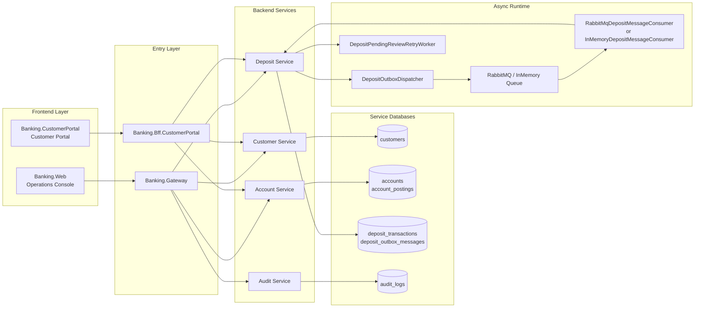
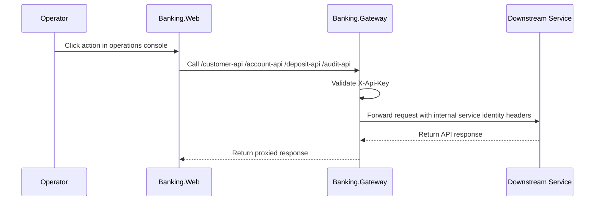
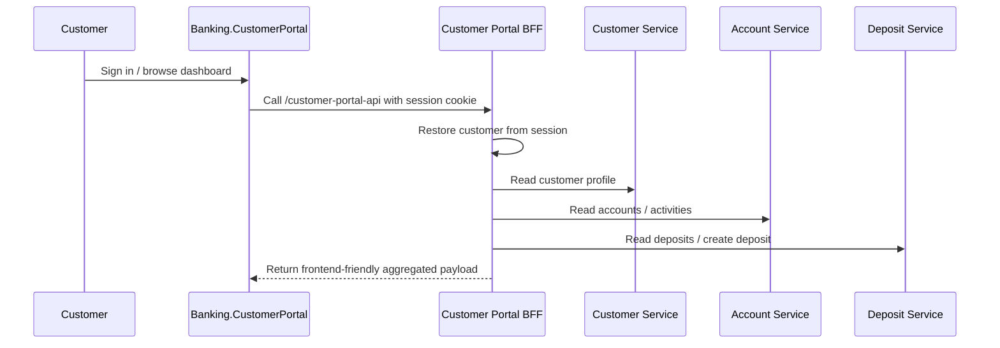
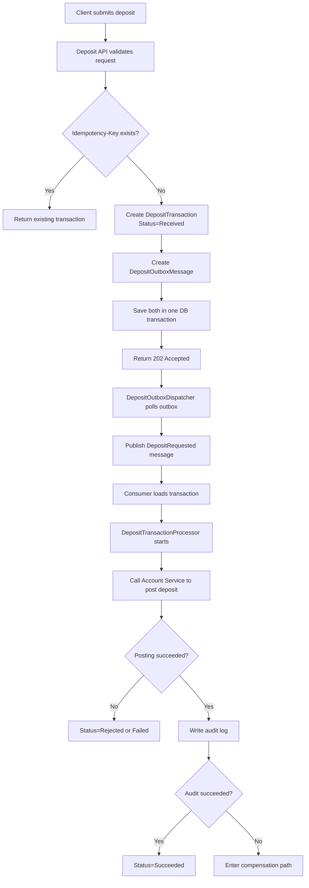
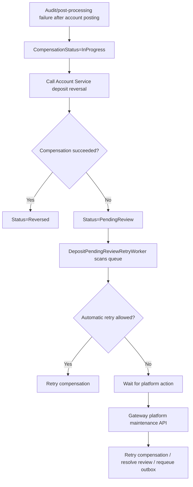
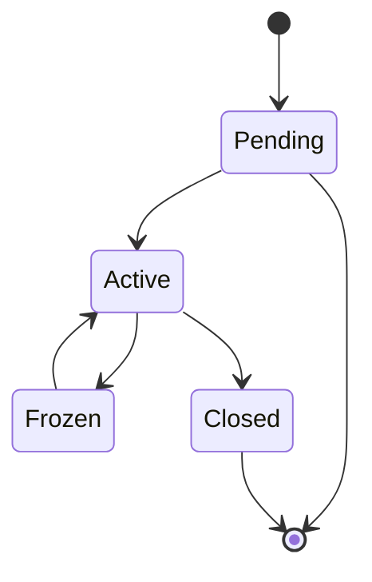
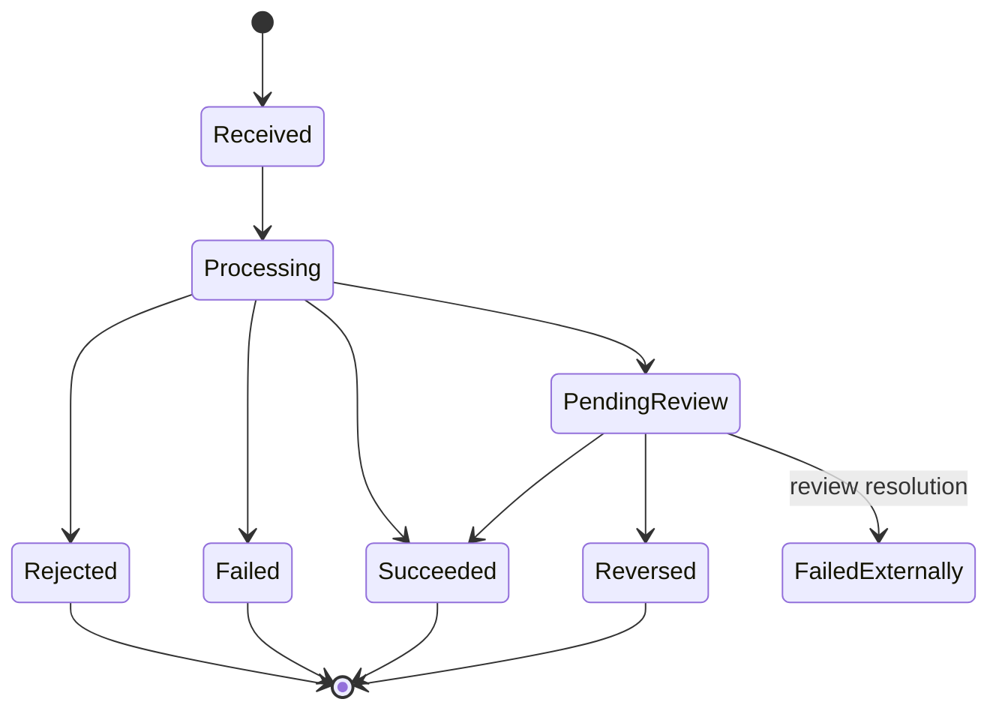
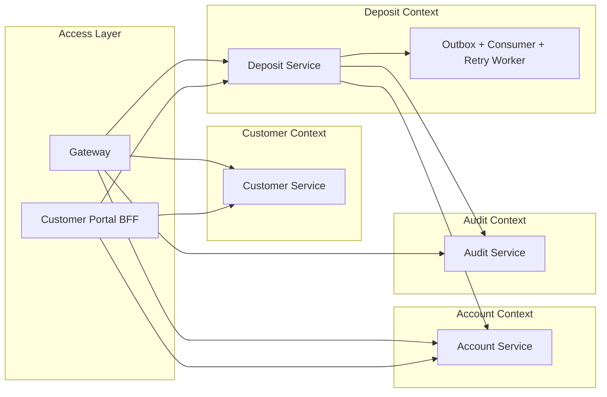
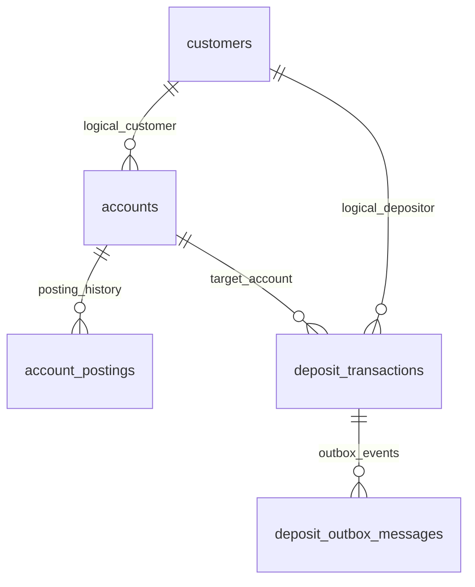

# Current Core Diagrams

The Chinese Mermaid diagrams are available in [docs/ch-cn/07-core-diagrams.zh-CN.md](/E:/DemoProjects/BasicBankingSystem/docs/ch-cn/07-core-diagrams.zh-CN.md).

This document reflects the current implementation in the repository, not the earlier Phase 1 proposal.

Included diagrams:

- Runtime architecture
- Operations console request path
- Customer portal request path
- Deposit workflow
- Deposit review and retry flow
- Customer state diagram
- Account state diagram
- Deposit transaction state diagram
- Service boundary diagram
- Domain relationship diagram

## 1. Runtime Architecture



## 2. Operations Console Request Path



## 3. Customer Portal Request Path



## 4. Deposit Workflow



## 5. Deposit Review And Retry Flow



## 6. Customer State Diagram



## 7. Account State Diagram

```mermaid22 
stateDiagram-v2
  [*] --> Active
  Active --> Frozen
  Frozen --> Active
  Active --> Closed
  Closed --> [*]
```

## 8. Deposit Transaction State Diagram



## 9. Service Boundary Diagram



## 10. Domain Relationship Diagram



## Recommended Review Set

For the current codebase, present these six first:

1. Runtime architecture
2. Operations console request path
3. Customer portal request path
4. Deposit workflow
5. Deposit review and retry flow
6. Deposit transaction state diagram
