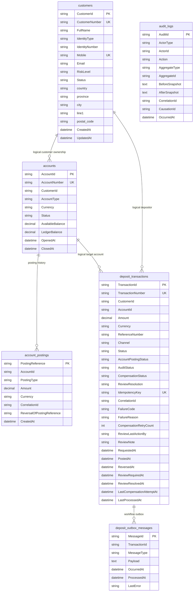

# Database Schema And Relationships

## Purpose

This document reflects the current PostgreSQL-oriented persistence model used by the implemented backend services.

## Design Note

The project follows microservice boundaries, so several relationships are logical references rather than physical foreign keys.

Examples:

- `accounts.CustomerId` points to a customer owned by `Customer Service`
- `deposit_transactions.AccountId` points to an account owned by `Account Service`
- `deposit_transactions.CustomerId` is a logical depositor reference
- `audit_logs.AggregateId` is polymorphic and depends on `AggregateType`

That means the diagram below shows:

- physical tables per service
- logical cross-service references

## Mermaid ER Diagram

## Table Ownership By Service

### Customer Service

Owns:

- `customers`

Relevant source:

- `src/Banking.Services.Customer/Data/CustomerDbContext.cs`
- `src/Banking.Services.Customer/Domain/Customer.cs`

Key notes:

- unique index on `CustomerNumber`
- unique index on `Mobile`
- unique composite index on `IdentityType + IdentityNumber`
- address stored as an owned value object flattened into the `customers` table

### Account Service

Owns:

- `accounts`
- `account_postings`

Relevant source:

- `src/Banking.Services.Account/Data/AccountDbContext.cs`
- `src/Banking.Services.Account/Domain/Account.cs`
- `src/Banking.Services.Account/Domain/AccountPosting.cs`

Key notes:

- `AccountNumber` is unique
- `CustomerId` is indexed for account-by-customer lookup
- `account_postings` is append-style history for deposit, withdrawal, and reversal events
- `ReversalOfPostingReference` is indexed to support reversal lookups

### Deposit Service

Owns:

- `deposit_transactions`
- `deposit_outbox_messages`

Relevant source:

- `src/Banking.Services.Deposit/Data/DepositDbContext.cs`
- `src/Banking.Services.Deposit/Domain/DepositTransaction.cs`
- `src/Banking.Services.Deposit/Messaging/DepositOutboxMessage.cs`

Key notes:

- `TransactionNumber` is unique
- `IdempotencyKey` is unique
- deposit workflow status is stored explicitly through `Status`, `AccountPostingStatus`, `AuditStatus`, `CompensationStatus`, and `ReviewResolution`
- `Status + LastCompensationAttemptAt` index supports pending review retry scanning
- `ProcessedAt + OccurredAt` index supports outbox polling

### Audit Service

Owns:

- `audit_logs`

Relevant source:

- `src/Banking.Services.Audit/Data/AuditDbContext.cs`
- `src/Banking.Services.Audit/Domain/AuditLog.cs`

Key notes:

- `BeforeSnapshot` and `AfterSnapshot` are stored as serialized dictionaries
- `CorrelationId` is indexed
- `AggregateType + AggregateId` is indexed for aggregate-level audit lookup

## Relationship Notes

### Customer To Account

- one customer can have many accounts
- the relationship is logical through `accounts.CustomerId`
- there is no physical cross-service foreign key

### Account To Posting

- one account can have many account postings
- postings represent balance-affecting history such as deposit posting, withdrawal, and deposit reversal

### Deposit To Account And Customer

- each deposit transaction refers logically to one customer and one account
- `Deposit Service` stores the workflow state
- `Account Service` remains the owner of actual balance mutation

### Deposit To Outbox

- the deposit service persists an outbox record alongside the main deposit transaction
- outbox records are dispatched asynchronously by a hosted worker
- this is the repository’s concrete outbox implementation

### Audit Log Model

- audit logs are generic and polymorphic
- they are not strongly tied to a single table by a foreign key
- lookup depends on `AggregateType` and `AggregateId`

## What Changed From The Earlier Design

Compared with the earlier design docs, the current implementation:

- does not include a separate persisted query/read-model service
- uses BFF and gateway aggregation instead of a dedicated read-model database
- keeps the core persisted model focused on customer, account, deposit workflow, outbox, and audit
