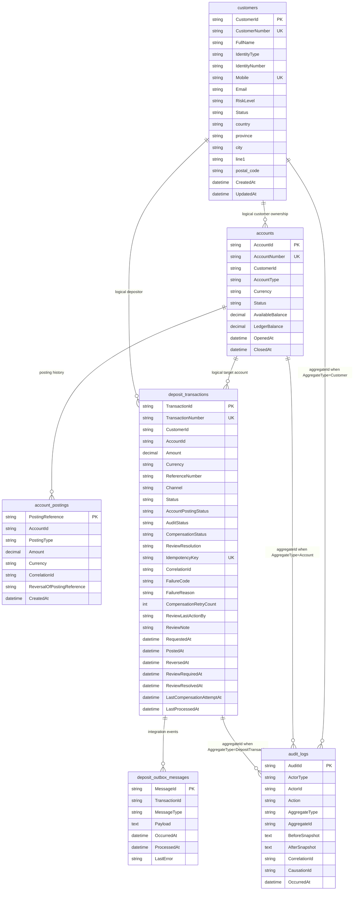

# Database Schema And Relationships

## Purpose

This document visualizes the current PostgreSQL table structure used by the backend services and explains how the main records relate to each other.

## Design Note

This project uses microservice boundaries, so several cross-service relationships are stored as logical references rather than physical foreign keys.

Examples:

- `accounts.CustomerId` points to a customer owned by `Customer Service`
- `deposit_transactions.AccountId` points to an account owned by `Account Service`
- `audit_logs.AggregateId` may point to deposits, accounts, or other aggregates depending on the action

That means the ER diagram below shows both:

- physical table ownership
- logical cross-service relationships

## Mermaid ER Diagram

## Table Ownership By Service

### Customer Service

Owns:

- `customers`

Relevant source:

- `src/Banking.Services.Customer/Data/CustomerDbContext.cs`
- `src/Banking.Services.Customer/Domain/Customer.cs`

### Account Service

Owns:

- `accounts`
- `account_postings`

Relevant source:

- `src/Banking.Services.Account/Data/AccountDbContext.cs`
- `src/Banking.Services.Account/Domain/Account.cs`
- `src/Banking.Services.Account/Domain/AccountPosting.cs`

### Deposit Service

Owns:

- `deposit_transactions`
- `deposit_outbox_messages`

Relevant source:

- `src/Banking.Services.Deposit/Data/DepositDbContext.cs`
- `src/Banking.Services.Deposit/Domain/DepositTransaction.cs`
- `src/Banking.Services.Deposit/Messaging/DepositOutboxMessage.cs`

### Audit Service

Owns:

- `audit_logs`

Relevant source:

- `src/Banking.Services.Audit/Data/AuditDbContext.cs`
- `src/Banking.Services.Audit/Domain/AuditLog.cs`

## Relationship Notes

### Customer To Account

- one customer can have many accounts
- enforced logically through `accounts.CustomerId`
- not a database foreign key because `Customer Service` and `Account Service` are separate service boundaries

### Account To Account Posting

- one account can have many postings
- this is the account activity history table
- deposit, withdrawal, and reversal flows all materialize here

### Deposit To Account

- each deposit transaction targets one account
- the actual balance change is executed by `Account Service`
- the deposit service keeps the workflow state, not the balance itself

### Deposit To Outbox

- each deposit can produce one or more outbox records
- these records are dispatched asynchronously
- this supports reliable event publication

### Audit Logs

- audit records are generic and can refer to different aggregate types
- this is why the relationship to business tables is polymorphic through `AggregateType + AggregateId`
