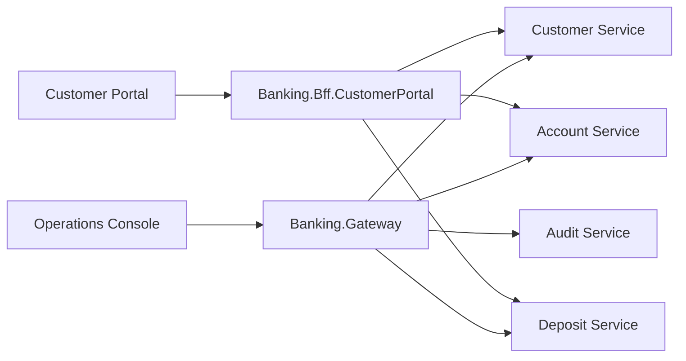

# Gateway And Customer BFF Design

## Purpose

This document defines the next-stage entry-layer design for the project.

The main goal is to separate:

- operator-facing system access
- customer-facing self-service access

The recommended shape is:

- `Banking.Gateway` for operator and platform entry concerns
- `Banking.Bff.CustomerPortal` for customer portal authentication, scoping, and aggregation

## Why Split Gateway And BFF

The current system already has two very different user experiences:

- `Banking.Web` for operations staff
- `Banking.CustomerPortal` for customers

These two clients have different needs.

`Operations Console` needs:

- broad service access
- operational workflows
- review and recovery actions
- audit visibility
- admin-style troubleshooting

`Customer Portal` needs:

- customer-scoped authentication
- simple customer-safe DTOs
- no exposure of internal identifiers
- no access to review, audit, or internal workflow controls

A generic gateway is not the same thing as a Backend for Frontend.

## Recommended Access Topology



## Responsibility Split

### Banking.Gateway

`Banking.Gateway` should become the operator and platform entry point.

Recommended responsibilities:

- route operator traffic to backend services
- centralize operator authentication and shared headers
- apply correlation IDs consistently
- provide health aggregation
- provide OpenAPI or Swagger aggregation
- become the future place for rate limiting and cross-service observability hooks

Avoid putting these concerns into `Banking.Gateway`:

- customer sign-in session handling
- customer-specific DTO shaping
- customer dashboard aggregation
- portal-specific workflow composition

### Banking.Bff.CustomerPortal

`Banking.Bff.CustomerPortal` should become the dedicated customer-facing edge service.

Recommended responsibilities:

- customer sign-in and sign-out
- server-side session management
- customer-scoped authorization
- translating business identifiers into internal service calls
- composing dashboard and account views for the portal
- hiding internal IDs and operational fields

Avoid putting these concerns into `Banking.Bff.CustomerPortal`:

- direct database access
- domain ownership for balances or deposits
- audit or pending-review operations
- replacing existing domain services

## Key Design Principle

The customer portal should work only with business identifiers:

- `customerNumber`
- `accountNumber`
- `transactionNumber`

It should not send or depend on:

- `customerId`
- `accountId`
- internal correlation and causation references unless explicitly customer-safe

The BFF acts as an anti-corruption layer between customer-facing UI models and internal service contracts.

## Authentication Design

### Phase 1

Use a lightweight server-side session model:

- sign in with `customerNumber`
- validate `identityLast4`
- create a server-side session
- issue an `HttpOnly` cookie

This preserves a realistic client boundary without forcing a full IAM implementation too early.

### Why Session-Based Auth First

- simpler than introducing JWT and OIDC immediately
- avoids teaching the portal to store security tokens
- keeps customer identity state on the server side
- provides a clean migration path to future identity providers

### Session Payload

Keep session state intentionally small:

- `customerId`
- `customerNumber`
- `fullName`
- `role = Customer`

Do not store full customer profile objects in session.

## Authorization Rules

The BFF should enforce these rules before calling downstream services:

- unauthenticated requests return `401`
- authenticated customers can only access their own accounts
- authenticated customers can only access their own transactions
- authenticated customers can only submit deposits and withdrawals on their own accounts
- customer-facing APIs must not expose review queues, audit APIs, or internal recovery actions

## Proposed BFF API Surface

### Authentication

- `POST /api/customer-portal/auth/sign-in`
- `POST /api/customer-portal/auth/sign-out`
- `GET /api/customer-portal/auth/me`

### Dashboard

- `GET /api/customer-portal/dashboard`

### Accounts

- `GET /api/customer-portal/accounts`
- `GET /api/customer-portal/accounts/{accountNumber}`
- `GET /api/customer-portal/accounts/{accountNumber}/activities`

### Transactions

- `GET /api/customer-portal/transactions`
- `GET /api/customer-portal/transactions/{transactionNumber}`

### Customer Actions

- `POST /api/customer-portal/deposits`
- `POST /api/customer-portal/withdrawals`

## Example Internal Call Mapping

The portal calls:

- `GET /api/customer-portal/accounts/622220.../activities`

The BFF resolves the authenticated customer session, verifies ownership, then internally calls:

- `Account Service` account lookup by account number
- `Account Service` activity endpoint using the internal account ID

The portal never sees the internal ID.

## DTO Shaping

The BFF should not simply forward raw service responses.

### Example Customer-Facing Account DTO

```json
{
  "accountNumber": "62222026033114164845175",
  "accountType": "Checking",
  "status": "Active",
  "currency": "USD",
  "availableBalance": 1030.0,
  "ledgerBalance": 1030.0
}
```

### Fields To Hide

- `accountId`
- `customerId`
- internal service correlation details
- review metadata
- operational failure annotations not intended for customers

## Suggested Project Layout

```text
src/
  Banking.Gateway/
  Banking.Bff.CustomerPortal/
    Auth/
    Clients/
    Contracts/
    Controllers/
    Extensions/
    Services/
```

Recommended internal layers for the BFF:

- `Controllers` for HTTP endpoints
- `Auth` for cookie or session handling
- `Clients` for service-to-service API wrappers
- `Services` for portal-specific orchestration
- `Contracts` for customer-safe DTOs

## Important Patterns

This design intentionally combines:

- `Gateway Pattern`
- `Backend for Frontend`
- `Facade`
- `Session-Based Authentication`
- `Anti-Corruption Layer`
- `DTO Composition`

## Gateway Evolution Plan

### Phase 1

Keep `Banking.Gateway` as a shell, but clarify its target role in the architecture documents.

### Phase 2

Add:

- route forwarding
- health aggregation
- operator-oriented OpenAPI aggregation
- shared header and correlation support

### Phase 3

Add:

- operator authorization integration
- rate limiting
- central logging and metrics hooks

## Customer BFF Implementation Plan

### Phase 1

- create `Banking.Bff.CustomerPortal`
- move portal sign-in to BFF
- add `auth/me`
- add `accounts`
- add `account activities`
- add customer-scoped `deposit` and `withdrawal`

### Phase 2

- add dashboard aggregation
- add customer transaction timeline
- improve error model and session timeout handling

### Phase 3

- replace demo sign-in with real IAM or OIDC
- introduce stronger session protection
- add statement download and notification preferences

## Trade-Offs

### Why Not Use Only The Gateway

Because a generic gateway does not solve:

- customer-specific authorization
- customer-friendly DTO design
- customer dashboard aggregation
- safe abstraction over internal domain contracts

### Why Not Let The Portal Call Services Directly

Because direct calls:

- expose internal service model details
- make authorization harder to centralize
- couple the portal to internal API evolution
- blur the boundary between customer and operator capabilities

### Why Not Build Full IAM First

Because the project gains more value from showing the correct architectural boundary now, then evolving the auth mechanism later.

## Source References

Current code that informs this design:

- [Banking.Gateway/Program.cs](/E:/DemoProjects/BasicBankingSystem/src/Banking.Gateway/Program.cs)
- [Banking.CustomerPortal/App.tsx](/E:/DemoProjects/BasicBankingSystem/src/Banking.CustomerPortal/src/App.tsx)
- [Banking.Web/App.tsx](/E:/DemoProjects/BasicBankingSystem/src/Banking.Web/src/App.tsx)
- [CustomersController.cs](/E:/DemoProjects/BasicBankingSystem/src/Banking.Services.Customer/Controllers/CustomersController.cs)
- [AccountsController.cs](/E:/DemoProjects/BasicBankingSystem/src/Banking.Services.Account/Controllers/AccountsController.cs)
- [DepositsController.cs](/E:/DemoProjects/BasicBankingSystem/src/Banking.Services.Deposit/Controllers/DepositsController.cs)

## Outcome

After this change, the architecture becomes easier to explain:

- operators enter through a shared gateway
- customers enter through a dedicated BFF
- services remain the system of record
- UI clients stay aligned to their trust boundaries
