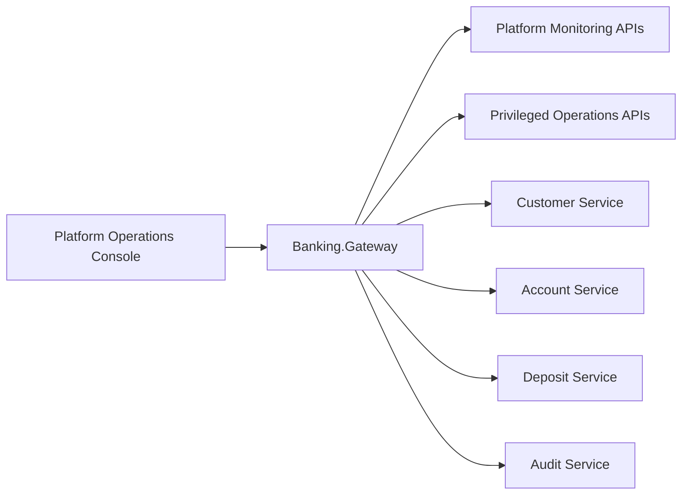

# Platform Operations Console Detailed Design

## Purpose

This document turns the platform-operations direction into a concrete design for:

- UI modules
- API surface
- permission boundaries
- audit expectations
- implementation phases

It builds on:

- [Platform Identity And Operations Architecture](./34-platform-identity-and-operations-architecture.md)
- [Gateway And Customer BFF Design](./32-gateway-and-customer-bff-design.md)

## Design Goal

The `Platform Operations Console` is the runtime control plane for the platform.

It is not a replacement for:

- `Customer Portal`
- `Business Operations Console`
- local developer scripts

It exists to support:

- platform health visibility
- workflow monitoring
- diagnosis
- controlled maintenance
- support operations
- environment and test governance

## Primary Users

The first supported personas should be:

- `PlatformOperator`
- `SupportEngineer`
- `SREOperator`
- `PlatformAdministrator`
- `SecurityAdministrator`
- `TestEnvironmentAdministrator`

Not every persona should see every module or action.

## Scope Boundary

### In Scope

- service health aggregation
- dependency status visibility
- queue and worker visibility
- workflow-state monitoring
- diagnostics and correlation lookup
- controlled retry and maintenance actions
- environment and test account governance
- audit trail for privileged operations

### Out Of Scope

- customer self-service
- ordinary branch or teller workflows
- customer onboarding
- account opening as a daily business action
- raw infrastructure provisioning
- developer IDE-like features

## High-Level Topology

Recommended access shape:



Recommendation:

- use `Banking.Gateway` as the future entry point for platform-operations APIs
- do not expose platform-only endpoints directly to customer-facing surfaces

## Main Navigation Model

Suggested top-level navigation:

1. Overview
2. Services
3. Workflows
4. Diagnostics
5. Maintenance
6. Accounts And Access
7. Test Utilities
8. Audit Trail

This is intentionally different from the current `Operations Console`, which is organized around customer and account workflows.

## Detailed Module Design

### 1. Overview

Purpose:

- provide immediate platform status to operators

Key widgets:

- service availability summary
- dependency summary
- queue and worker summary
- pending incidents
- workflow exception summary
- recent maintenance actions

Example cards:

- `Customer Service: Healthy`
- `Account Service: Healthy`
- `Deposit Service: Degraded`
- `Audit Service: Healthy`
- `PendingReview > 50`
- `Outbox backlog detected`

Primary users:

- all platform personas

Recommended actions:

- drill into services
- drill into workflow exceptions
- open recent alerts

### 2. Services

Purpose:

- inspect service-by-service runtime state

Views:

- service list
- service detail
- dependency detail

Fields:

- health status
- readiness status
- dependency statuses
- version/build info
- last heartbeat
- recent error rate
- request latency

Suggested future signals:

- database connectivity
- RabbitMQ connection state
- worker registration state
- deployment revision

Primary users:

- platform operators
- SRE
- support engineers

### 3. Workflows

Purpose:

- inspect business workflows from an operational lens

Initial focus should be the deposit workflow because it already exposes rich orchestration state.

Views:

- deposit workflow dashboard
- pending review queue insights
- compensation failure insights
- audit failure insights
- idempotency replay activity

Suggested metrics:

- deposit status distribution
- pending review count and age buckets
- compensation retry count
- outbox pending count
- audit failed count
- average completion time
- replay storm count by caller

Example drill-down:

- select a transaction
- show workflow timeline
- show current state
- show related correlation ID
- show recent maintenance actions against that transaction

Primary users:

- platform operators
- support engineers
- selected business supervisors with read-only access

### 4. Diagnostics

Purpose:

- let operators investigate issues without direct shell access

Views:

- correlation ID search
- transaction lookup
- audit lookup
- dependency error explorer
- request trace explorer

Search keys:

- correlation ID
- transaction ID
- transaction number
- account number
- customer number
- audit ID

Useful output:

- timeline of cross-service events
- current workflow state
- last error
- related audit events
- related maintenance actions

Primary users:

- support engineers
- platform operators
- security administrators for investigations

### 5. Maintenance

Purpose:

- expose tightly controlled repair actions

This module must be permissioned more strictly than read-only diagnostics.

Initial actions:

- retry deposit compensation
- re-run pending review recovery
- republish outbox item
- disable automatic retry temporarily
- mark workflow under investigation

Each action should require:

- reason text
- operator identity
- audit event emission
- confirmation step

Higher-risk actions may later require:

- second approval
- step-up authentication
- ticket or incident reference

Primary users:

- platform operators
- support engineers with elevated rights
- administrators

### 6. Accounts And Access

Purpose:

- govern platform-side identities and privileged access

Views:

- platform user inventory
- service identity inventory
- role assignment review
- test account inventory
- expiring support access

Initial capabilities:

- view identities and roles
- review privilege grants
- review break-glass events
- review test-account ownership

Write actions should be introduced carefully and audited heavily.

Primary users:

- platform administrators
- security administrators

### 7. Test Utilities

Purpose:

- support platform verification and non-production operations safely

Views:

- smoke test launcher
- synthetic transaction runner
- environment verification dashboard
- test account inventory

Important boundary:

- production-safe synthetic monitoring is different from ad hoc developer testing
- destructive or data-reset operations must stay non-production only

Primary users:

- test environment administrators
- SRE
- support engineers

### 8. Audit Trail

Purpose:

- provide a platform-side view of privileged actions and investigations

Views:

- maintenance actions log
- role-change log
- privileged sign-in log
- break-glass usage log
- support investigation log

Search filters:

- actor
- role
- action type
- target aggregate
- environment
- time window

Primary users:

- security administrators
- platform administrators
- compliance reviewers

## Proposed API Surface

These are platform-facing APIs, likely fronted by `Banking.Gateway`.

### Overview APIs

- `GET /api/platform/overview`
- `GET /api/platform/incidents`

### Service Status APIs

- `GET /api/platform/services`
- `GET /api/platform/services/{serviceName}`
- `GET /api/platform/dependencies`

### Workflow Monitoring APIs

- `GET /api/platform/workflows/deposits/summary`
- `GET /api/platform/workflows/deposits/pending-review`
- `GET /api/platform/workflows/deposits/{transactionId}`
- `GET /api/platform/workflows/deposits/replay-activity`

### Diagnostics APIs

- `GET /api/platform/diagnostics/correlation/{correlationId}`
- `GET /api/platform/diagnostics/transactions/{transactionId}`
- `GET /api/platform/diagnostics/audits/{auditId}`

### Maintenance APIs

- `POST /api/platform/maintenance/deposits/{transactionId}/retry-compensation`
- `POST /api/platform/maintenance/outbox/{messageId}/republish`
- `POST /api/platform/maintenance/workers/{workerName}/pause`
- `POST /api/platform/maintenance/workers/{workerName}/resume`

### Accounts And Access APIs

- `GET /api/platform/access/users`
- `GET /api/platform/access/service-identities`
- `GET /api/platform/access/test-accounts`
- `GET /api/platform/access/privileged-events`

### Test Utilities APIs

- `POST /api/platform/test/smoke-runs`
- `POST /api/platform/test/synthetic-deposits`
- `GET /api/platform/test/runs/{runId}`

### Audit APIs

- `GET /api/platform/audit/operations`
- `GET /api/platform/audit/operations/{operationId}`

## Permission Model

Suggested platform roles:

- `PlatformObserver`
- `PlatformOperator`
- `SupportEngineer`
- `PlatformAdministrator`
- `SecurityAdministrator`
- `TestEnvironmentAdministrator`

## Module Permission Matrix

### Overview

- `PlatformObserver`: read
- `PlatformOperator`: read
- `SupportEngineer`: read
- `PlatformAdministrator`: read
- `SecurityAdministrator`: read

### Services

- `PlatformObserver`: read
- `PlatformOperator`: read
- `SupportEngineer`: read
- `PlatformAdministrator`: read

### Workflows

- `PlatformObserver`: read limited
- `PlatformOperator`: read
- `SupportEngineer`: read
- `PlatformAdministrator`: read
- `PlatformOperator`: controlled write for approved maintenance paths
- `SupportEngineer`: controlled write for approved maintenance paths

### Diagnostics

- `PlatformObserver`: no access or very limited
- `PlatformOperator`: read
- `SupportEngineer`: read
- `PlatformAdministrator`: read
- `SecurityAdministrator`: read for investigations

### Maintenance

- `PlatformOperator`: limited write
- `SupportEngineer`: limited write
- `PlatformAdministrator`: broader write
- `SecurityAdministrator`: usually read-only unless security action is involved

### Accounts And Access

- `PlatformAdministrator`: read/write
- `SecurityAdministrator`: read/write
- others: read-only or no access depending on policy

### Test Utilities

- `TestEnvironmentAdministrator`: read/write in allowed environments
- `PlatformAdministrator`: read/write
- `SupportEngineer`: limited use

### Audit Trail

- `SecurityAdministrator`: read
- `PlatformAdministrator`: read
- `PlatformOperator`: read limited

## Action Safety Levels

All write actions in the platform console should be classified.

### Level 1: Read-Only

Examples:

- view service status
- search correlation ID
- inspect workflow state

### Level 2: Controlled Operational Action

Examples:

- retry pending review compensation
- republish outbox message
- trigger smoke test

Requirements:

- reason required
- action audit required
- confirmation required

### Level 3: Privileged Maintenance Action

Examples:

- pause a worker
- disable retry logic
- modify privileged access

Requirements:

- stronger role requirement
- reason required
- audit required
- optional second approval
- optional step-up authentication

### Level 4: Emergency / Break-Glass

Examples:

- production bypass operations
- security emergency actions

Requirements:

- highly restricted access
- explicit incident reference
- maximum audit detail
- post-incident review

## Audit Requirements

The platform console must generate its own audit trail, not rely only on domain audit events.

Each privileged action should record:

- actor identity
- principal type
- role set
- action name
- target object
- environment
- reason
- correlation ID
- result
- timestamp

For investigations, it is also useful to record:

- search target
- high-sensitivity data access
- export actions

## Non-Functional Requirements

### Availability

- read-only overview pages should tolerate partial dependency failure
- degraded modules should still render partial data when possible

### Performance

- overview should load quickly with summarized data
- heavy searches should use explicit filters and pagination

### Security

- no shared operator accounts
- session timeout for privileged users
- action confirmation for maintenance operations
- least-privilege defaults

### Observability

- platform console actions should emit logs, metrics, and traces
- backend monitoring APIs should expose correlation-friendly identifiers

## Suggested Data Contracts

### Service Summary

Fields:

- serviceName
- healthStatus
- readinessStatus
- dependencyCount
- degradedDependencyCount
- version
- lastCheckedAt

### Deposit Workflow Summary

Fields:

- totalReceived
- totalProcessing
- totalSucceeded
- totalFailed
- totalPendingReview
- averageCompletionSeconds
- outboxPendingCount
- auditFailureCount
- compensationFailureCount

### Maintenance Action Record

Fields:

- operationId
- actionType
- actorId
- actorRole
- targetType
- targetId
- environment
- reason
- result
- occurredAt

## UI Implementation Direction

Recommended implementation path:

- keep `Business Operations Console` focused on customer and workflow operations
- create a separate frontend for platform operations rather than overloading `Banking.Web`

Recommended future project shape:

```text
src/
  Banking.Web/                      # business operations console
  Banking.CustomerPortal/           # customer portal
  Banking.PlatformOps/              # platform operations console
  Banking.Gateway/                  # shared operator/platform entry layer
```

This keeps the user experience aligned to trust boundaries.

## Delivery Phases

### Phase 1: Read-Only Platform Monitoring

- overview page
- services page
- workflow summary page
- diagnostics search by correlation ID

### Phase 2: Controlled Workflow Maintenance

- pending review operational page
- retry actions
- outbox visibility
- maintenance action audit trail

### Phase 3: Accounts And Access Governance

- platform identity inventory
- test account inventory
- privileged event review

### Phase 4: Advanced Platform Controls

- worker pause/resume
- operational feature toggles
- stronger approval workflows

## Initial Repository Impact

The most natural next code steps in this repository are:

1. add platform monitoring DTOs and APIs behind `Banking.Gateway`
2. aggregate existing `health`, `ready`, `pending review`, and deposit status signals
3. introduce platform-specific authorization policies
4. create a new frontend shell for `Banking.PlatformOps`
5. add audit events for privileged maintenance actions

## Outcome

With this design, the project grows from a business workflow demo into a more realistic operated platform:

- business users keep a focused workflow console
- platform operators get a dedicated control plane
- privileged actions become explicit and auditable
- monitoring, support, and test tooling become part of the product design rather than hidden operational leftovers
